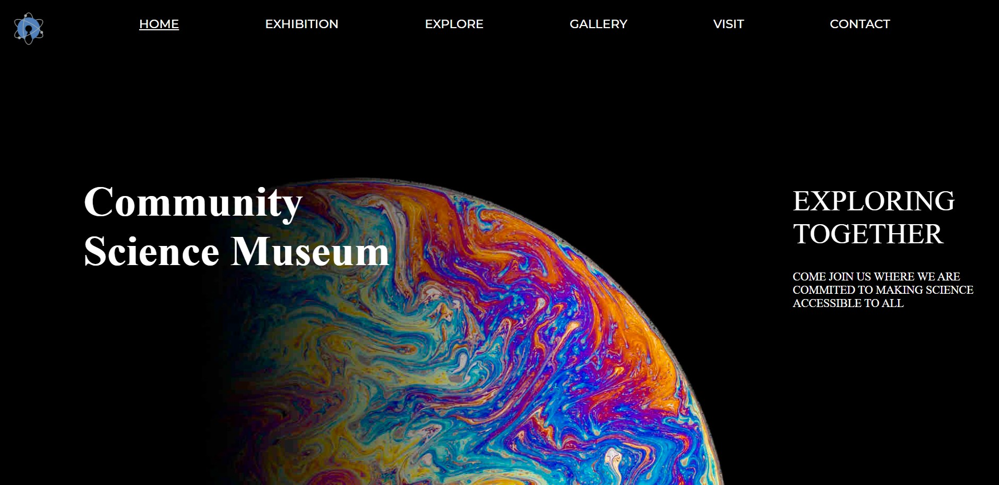

# Semester Project 1



## Description

The brief in this semester project was to create a website for an interactive science museum called the Community Science Museum, responsive and easy to use on a variety of devices.

The target group for this site is primary and middle school children (7-15) and families with young children. 

The website consists of 6 pages:

- Home
- Galery
- An explore site where the user explore all the thing the musem can offer, either for kids, teachers or researchers
- an Exhibition site - where the user can explore all of our exhibition spaces and all the things you can do at our museum
- Checkout success
- About
- Contact

## Built With

This site was built with

- HTML
- CSS

## Getting Started

The project does not contain any dependencies, and can easily be installed/run by cloning the GitHub repo.


```bash
git clone https://github.com/Ingvildb1/semester-project-1.git
```


## Contributing

I am a newbie to front-end development, and I am very sure there are many improvements to be made. If you wish to contribute by sending in feedback, you are welcome to do so.

## Contact


[My LinkedIn page](www.linkedin.com/in/ingvild-berger-7268771b3)
